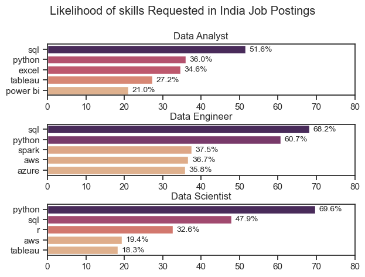
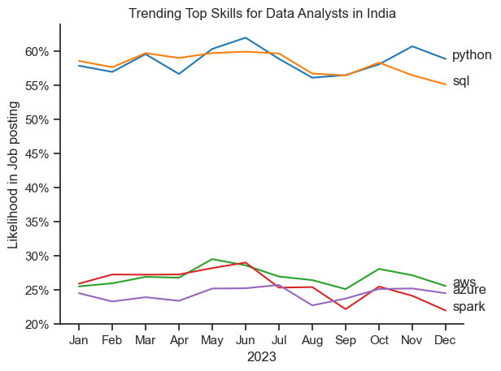
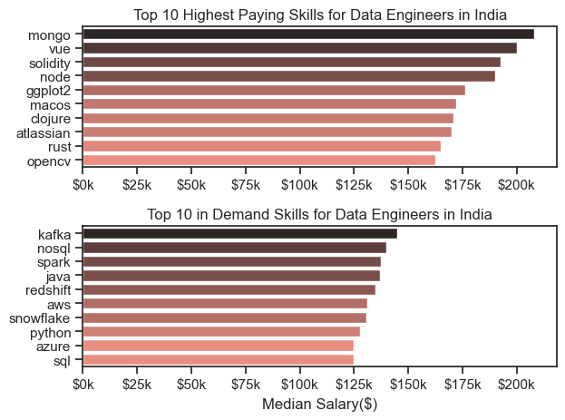
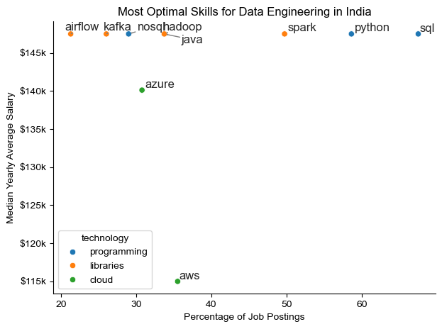

# 🚀 **INDIAN DATA TECH JOB MARKET ANALYSIS**

## 📌 **Project Overview**
As the data landscape rapidly evolves, choosing the right technical stack and understanding market expectations is critical for data professionals. This project offers a comprehensive, data-driven analysis of the tech job market in India, focusing on roles like **Data Analysts, Data Engineers and Data Scientists**. 

By analyzing thousands of real-world job postings, this project uncovers the true trajectories of skill demands, maps out salary distributions across tech paths, and isolates the most optimal technical competencies to maximize career growth and earning potential.


## 💾 **Data Source**
The underlying data used for this analysis is sourced from the public **Data Jobs** dataset created by Luke Barousse and hosted on Hugging Face. It contains global metadata on tech job postings, including salaries, locations, and required skills.

🔗 **Explore the original dataset here:** [Hugging Face - Data Jobs Dataset](https://huggingface.co/datasets/lukebarousse/data_jobs)


## 🎯 **Objectives**
* **Identify Core Duopolies:** Evaluate the continuous market battle between foundational programming languages (SQL vs. Python).
* **Map Salary Architectures:** Breakdown baseline compensation, interquartile ranges, and high-earning anomalies across data roles.
* **Isolate Strategic Niche Premiums:** Contrast high-frequency enterprise demands against low-supply, high-paying niche skills.
* **Establish an Optimal Learning Roadmap:** Deliver data-backed pathways for professionals targeting specific technical roles.


## 🛠️ **Tools I Used**

For my deep dive into the data tech job market, I harnessed the power of several key tools:

* **Python:** The backbone of my analysis, allowing me to find critical trends and navigate the dataset. I utilized the following Python libraries:
    * **Pandas Library:** Used to clean, aggregate, filter and structure the data.
    * **Matplotlib Library:** Used to build the foundational data visualizations and handle fine-tuned plot styling.
    * **Seaborn Library:** Helped me create more advanced statistical visuals, themes and smooth color palettes.
* **Jupyter Notebooks:** The interactive environment I used to run my Python scripts, which let me easily document my thoughts, code and analytical findings step-by-step.
* **Visual Studio Code:** My go-to IDE for executing scripts, managing project folders, and drafting markdown documentation.
* **Git & GitHub:** Essential for version control and hosting my project files, ensuring clean code tracking and making the analysis publicly accessible.


# 📊 **ANALYSIS & INSIGHTS**

## 1. What are the most demanded skills for the top 3 most popular data roles?

To find the most demamded skills for the top 3 most popular data roles, I filtered the top the best three roles and got the top  5 skills for each of them. This query highlights the most popular job roles and their top skills

```python
fig, ax =plt.subplots(len(job_titles), 1)
sns.set_theme(style="ticks")

if len(job_titles) == 1:
    ax = [ax]

for i, job_title in enumerate(job_titles):
    df_plot = df_percent[df_percent['job_title_short'] == job_title].head(5)
    
    sns.barplot(data=df_plot, x='skill_percent', y='job_skills',    
    ax=ax[i], hue='skill_count',  palette='flare')
    ax[i].set_title(job_title)
    ax[i].set_ylabel('')
    ax[i].set_xlabel('')
    ax[i].set_xlim(0,80)
    ax[i].legend().set_visible(False)

    
    for n, v in enumerate(df_plot['skill_percent']):
        ax[i].text(v + 1, n, f'{v:.1f}%', va='center', fontsize=10)


    plt.show()
```
*View the notebook with detailed steps here :* [2_skills_Count.ipynb](Python_Data_job_project/2_Skills_count.ipynb) 

# Results


### 📊 Key Insights:

An analysis of the top skills requested in Indian job postings reveals clear distinctions in technical requirements between Data Analysts, Data Engineers and Data Scientists.


### 1. The Core Data Duopoly: SQL vs. Python
* **SQL is the foundation of data analysis and engineering:** It is the absolute number one requirement for Data Engineers (**68.2%**) and Data Analysts (**51.6%**), and remains a critical runner-up for Data Scientists (**47.9%**).
* **Python dominates advanced analytics:** It ranks as the most demanded skill for Data Scientists (**69.6%**) and is fiercely competitive in engineering roles (**60.7%**). For Analysts, it is a significant asset requested in over a third of postings (**36.0%**).

### 2. Role-Specific Technical Specializations
* **Data Analysts | Business Intelligence & Reporting:** This role heavily favors traditional data manipulation and visualization tools. Traditional spreadsheet proficiency via **Excel (34.6%)** remains highly relevant, followed closely by BI tools like **Tableau (27.2%)** and **Power BI (21.0%)**.
* **Data Engineers | Big Data & Cloud Infrastructure:** The engineering stack sharply shifts away from reporting tools and into scalable infrastructure. Demand is concentrated around cloud computing platforms like **AWS (36.7%)** and **Azure (35.8%)**, anchored by distributed processing via **Spark (37.5%)**.
* **Data Scientists | Advanced Modeling & Prototyping:** Statistical modeling tools dominate this space. Beyond Python, **R (32.6%)** remains a distinct requirement for scientific computing, alongside a baseline need for cloud architectures (**AWS at 19.4%**) and visualization (**Tableau at 18.3%**).

---

### 💡 Summary for Job Seekers
If you are targeting data roles in the Indian market, your baseline technical roadmap should prioritize:
1. **Universal Layer:** Master **SQL**, regardless of your chosen data path.
2. **Analytical Layer:** Combine **Python** with a visualization tool (**Tableau/Power BI**) for Analyst or Scientist tracks.
3. **Engineering Layer:** Combine **Python/SQL** with cloud ecosystems (**AWS/Azure**) and big data frameworks (**Spark**) for Engineering tracks.

## 2. How are in demand skills trending? 
To understand ho the most demanded skills trend, I visualized the top  5 skills. 

```python
df_plot = df_india_percent.iloc[:,:5]
sns.lineplot(data = df_plot, dashes=False, palette='tab10')
sns.set_theme(style='ticks') 
sns.despine()

plt.title('Trending Top Skills for Data Analysts in India')
plt.ylabel('Likelihood in Job posting')
plt.xlabel('2023')
plt.legend().remove()

from matplotlib.ticker import PercentFormatter
ax =plt.gca()
ax.yaxis.set_major_formatter(PercentFormatter(decimals=0))

for i in range(5):
    plt.text(11.2, df_plot.iloc[-1,i], df_plot.columns[i])
```
*View the notebook with detailed steps here :* [3_skills_Trend.ipynb](Python_Data_job_project/3_Skills_Trend.ipynb)

# Results



### 📈 Key Insights: Skill Trajectories from January to December (2023)

A close tracking of the month-by-month pipeline throughout 2023 reveals distinct macro-trends, seasonal peaks, and clear trajectories for the top data skills in India.

### 1. The Core Languages: Python & SQL 

* **Python (January to December Trend):** 
  * **The Path:** Python started the year strongly at ~58% in January, dipping slightly in February, before embarking on a massive mid-year rally. It peaked in June at its highest point of the year (~62%). Post-summer, it experienced a minor dip but rebounded aggressively in November (~61%) before ending December at a dominant **59%**.
  * **Overall Trajectory:** Upward and resilient. Python successfully established itself as the clear #1 skill by the end of the year.

* **SQL (January to December Trend):** 
  * **The Path:** SQL entered the year as the market leader in January at ~58.5%. It maintained a tight, neck-and-neck race with Python through the spring, hitting a shared peak of nearly 60% in March and June. However, the second half of the year marked a steady, gradual decline, dipping through the autumn and finishing at its lowest point of the year (~55%) in December.
  * **Overall Trajectory:** Gradual downward contraction, losing its majority market lead to Python by Q4.


### 2. The Cloud & Infra Tier: AWS, Azure, & Spark

* **AWS (January to December Trend):** 
  * **The Path:** Starting at ~25.5% in January, AWS demand climbed steadily throughout the spring, achieving a clear secondary-tier peak in May at nearly **30%**. Following this peak, it entered a gradual, oscillating descent through the summer and autumn, stabilizing to close December right back where it started at **25.5%**.
  * **Overall Trajectory:** Cyclical with a strong mid-year bump, maintaining its position as the leading cloud platform framework.

* **Azure (January to December Trend):** 
  * **The Path:** Azure was the definition of stability in 2023. It began January at ~24.5%, experienced minor, negligible fluctuations of less than 1% through the spring and summer, reached a minor peak in October (~25.5%), and wound down to close December at **24.5%**.
  * **Overall Trajectory:** Flat and remarkably consistent. It represents a highly predictable, evergreen market demand.

* **Spark (January to December Trend):** 
  * **The Path:** Spark began January at ~26%, outperforming AWS slightly in the winter months. It maintained a steady posture through the spring and pushed up to a year-high peak of ~29% in June. However, H2 2023 was unkind to Spark; it suffered a sharp, continuous downward trend through July, August, and September, finishing the year at its absolute nadir of **22%** in December.
  * **Overall Trajectory:** Distinctly downward in the latter half of the year, closing out 2023 as the least requested tool among the top five.

## 3. How well do jobs and Skills Pay For Data Analysts? 
### **SALARY ANALYSIS**
 I filtered out the top 6 data analysts roles for this analysis and visualized them through a boxplot

 ```python
 sns.boxplot(data =df_india_top6, x = 'salary_year_avg', y='job_title_short', order=job_order)

plt.title('Salary Distribution In India')
plt.ylabel('')
plt.xlabel('Yearly Salary AVG ($)')
ax = plt.gca()
ax.xaxis.set_major_formatter(plt.FuncFormatter(lambda x, pos: f'${int(x/1000)}k'))
plt.xlim(0, 300_000)
plt.show()
 ```
*View the notebook with detailed steps here :* [4_Salary_Analysis.ipynb](Python_Data_job_project/4_Salary_Analysis.ipynb)

# Results


### 💵 Key Insights: Salary Distribution by Data Role in India

A statistical breakdown of yearly average salaries across various data and software engineering roles highlights significant variations in earning potential, market demand, and compensation variance.


### 1. High-Earning Champions: Machine Learning & Data Science
* **Machine Learning Engineers Lead the Spread:** ML Engineers command some of the highest potential salaries in the market, with the top 25% (upper quartile) stretching well past **$165k** and maxing out near **$265k**. This role also displays the largest variance, indicating that specialized skills or company scale drastically impact compensation.
* **Data Scientists Maintain High Baselines:** Data Scientists hold the highest overall median salary on the chart at roughly **$115k**, with a tight, healthy middle-50% (interquartile range) spanning between **$80k** and **$155k**.

### 2. The Mid-Tier Core: Data Engineers & Data Analysts
* **Data Engineers Display High Upward Potential:** With a median salary hovering around **$95k**, Data Engineering roles show a solid baseline. The upper whisker reaches up to **$180k**, alongside a massive high-earning outlier approaching the **$250k** mark.
* **Data Analysts Offer a Dependable Baseline:** As an entry-to-mid-level gateway role, Data Analysts have a tighter distribution. The median sits comfortably at approximately **$100k**, with the bulk of the market ranging between **$70k** and **$115k**. The upper bound stays relatively capped around **$165k**, with minor outliers trailing slightly higher.

### 3. Key Statistical Anomalies & Outliers
* **The Senior Data Engineer Compression:** This distribution presents a highly unique structure where the main box is heavily compressed right up against its upper limit near **$145k**. The presence of a dense trail of lower-earning outliers (stretching down to **$35k**) suggests a market with a rigid corporate ceiling for standard roles, but significant entry-level variation or data reporting anomalies.
* **Software Engineers Entry Floor:** Standard Software Engineer roles in this dataset display a lower median (~$75k) and a highly compressed interquartile range. However, the presence of multiple high-earning outliers between **$120k** and **$200k** confirms that top-tier product firms or specific tech stacks break away drastically from typical market baselines.

---

### 💡 Strategic Summary for Professionals
* **For Maximum Earning Potential:** Transitioning toward **Machine Learning Engineering** or **Data Science** yields the highest upper-quartile caps and median returns.
* **For Career Longevity:** **Data Engineering** offers an exceptionally wide market spread, meaning continuous upskilling into cloud architectures translates directly into steady salary progression.

### **SKILLS ANALYSIS**

```python
fig, ax = plt.subplots(2,1)
sns.set_theme(style="ticks")

sns.barplot(data=df_top_pay, x='median', y=df_top_pay.index, ax=ax[0], hue='median', palette='dark:salmon_r')
ax[0].legend().remove()
ax[0].set_title('Top 10 Highest Paying Skills for Data Engineers in India')
ax[0].set_ylabel('')
ax[0].set_xlabel('')
ax[0].xaxis.set_major_formatter(plt.FuncFormatter(lambda x, _: f'${int(x/1000)}k'))

sns.barplot(data=df_top_skills, x='median', y=df_top_skills.index, ax=ax[1], hue='median', palette='dark:salmon_r')
ax[1].legend().remove()
ax[1].invert_yaxis()
ax[1].set_xlim(ax[0].get_xlim())
ax[1].set_title('Top 10 in Demand Skills for Data Engineers in India')
ax[1].set_ylabel('')
ax[1].set_xlabel('Median Salary($)')
ax[1].xaxis.set_major_formatter(plt.FuncFormatter(lambda x, _: f'${int(x/1000)}k'))

plt.tight_layout()
```
*View the notebook with detailed steps here :* [4_Salary_Analysis.ipynb](Python_Data_job_project/4_Salary_Analysis.ipynb)

# Results


### 💰Key Insights:Highest Paying vs. Most In-Demand Skills

An analysis of Data Engineering compensation reveals a striking reality: the niche skills that command the absolute highest premium salaries are fundamentally different from the core, high-frequency skills actually driving day-to-day market demand.


### 1. The High-Paying Niche Tier (Top Chart)
The highest-paying skills are dominated by specialized databases, web technologies, and niche development ecosystems.

* **Heavyweight Database & Web Stack:** **Mongo** leads the pack with a staggering median salary exceeding **$200k**, followed closely by frontend/backend powerhouse tools like **Vue** (~$200k) and **Node** (~$190k). 
* **The Web3 & Custom Tools Premium:** Blockchain specialization via **Solidity** sits comfortably in the top three at over **$192k**. Niche programming frameworks like **Clojure** and **Rust**, alongside specialized data packages like **ggplot2** and **OpenCV**, all command elite premiums between **$160k and $175k**.
* **The Reality:** These tools represent specialized, project-specific requirements. They yield massive compensation because the talent pool for them is incredibly small.

### 2. The Core Market Demand Tier (Bottom Chart)
The most frequently requested skills for Data Engineers represent the enterprise engine room—and while they don't reach $200k, their median baselines remain incredibly high.

* **Real-Time Data Pipelines Lead:** **Kafka** is the king of market demand compensation, commanding the highest median salary of the group at roughly **$145k**, followed by **NoSQL** frameworks at ~$140k.
* **The Big Data & Language Pillars:** Heavy enterprise processing tools like **Spark** and **Java** run neck-and-neck at approximately **$137k**. 
* **Cloud & SQL Baselines:** The standard foundational requirements—**Redshift**, **AWS**, **Snowflake**, **Python**, **Azure**, and **SQL**—cluster tightly between **$125k and $135k**. 

---
This visualization highlights an important career strategy path for Data Engineers in India:

1. **The In-Demand Core (The Bread & Butter):** Skills like **SQL, Python, AWS/Azure, Spark, and Kafka** are the baseline. They ensure maximum job volume, high career stability, and a highly competitive baseline salary ($125k–$145k).
2. **The High-Paying Niche (The Accelerator):** Layering your foundational stack with a specialized skill like **Mongo, Node, or Rust** unlocks elite-tier compensation ceilings ($160k–$200k+) at companies looking for highly specific technical infrastructure.


## 3. What is the most Optimal Skill to learn For Data Analysts? 


 ```python
 from adjustText import adjust_text

sns.scatterplot(
    data = df_plot,
    x= 'skill_percent',
    y= 'median_salary',
    hue = 'technology'
)
sns.despine()
sns.set_theme(style='ticks')
# preparing texts for adjustmnt
texts=[]
for i, txt in enumerate(
    df_DE_skills.index):
    texts.append(plt.text(
        df_DE_skills['skill_percent'].iloc[i], 
    df_DE_skills['median_salary'].iloc[i], txt))

# adjusting text to avoid overlap
adjust_text(texts, arrowprops=dict(arrowstyle="->", color='gray',lw=1.0))

ax = plt.gca()
ax.yaxis.set_major_formatter(plt.FuncFormatter(lambda y, pos: f'${int(y/1000)}k'))
plt.xlabel('Percentage of Job Postings')
plt.ylabel('Median Yearly Average Salary')
plt.title('Most Optimal Skills for Data Engineering in India')
plt.tight_layout()
plt.show()
 ```
 *View the notebook with detailed steps here :* [5_Optimal_skills.ipynb](Python_Data_job_project\5_Optimal_skills.ipynb)

# Results


### 🎯Insights: Strategic Positioning
By mapping **Median Yearly Average Salary** against **Percentage of Job Postings** (Demand Frequency), we can classify technologies into strategic quadrants: High-Demand Anchors, High-Value Specialists and Emerging Cloud Ecosystems.

### 1. The High-Demand Powerhouses (Top Right Quadrant)
These are the foundational staples of the data engineering profession in India. They offer maximum job security and sit comfortably at the top tier of compensation (~$147k).

* **SQL & Python Dominance:** **SQL** is the most ubiquitous skill on the market, appearing in nearly **68%** of all job postings. **Python** follows closely behind, anchoring nearly **59%** of the market. 
* **Spark's Sweet Spot:** **Spark** represents the optimal sweet spot for a big data engineer—present in a staggering **50%** of job postings while commanding the exact same premium salary ceiling (~$147k) as Python and SQL.

### 2. High-Value Specialists (Top Left Quadrant)
These tools require more specialized expertise. While they appear in fewer job descriptions (**20% to 35%**), they command maximum premium compensation (~$147k), making them excellent skills for breaking away from entry-level competition.

* **Pipeline & Streaming Orchestration:** **Airflow** (~21% demand) and **Kafka** (~26% demand) represent critical data infrastructure components that companies pay top dollar to maintain.
* **Storage & Processing Infrastructure:** Frameworks like **Hadoop**, **Java**, and **NoSQL** systems cluster tightly between **29% and 35%** demand. They carry high baseline salaries because they form the backend architecture of large enterprise data platforms.

### 3. The Cloud Ecosystem Divergence (Bottom Left)
One of the most fascinating takeaways from the data is the sharp variance between competing cloud service providers:

* **Azure | The High-Value Alternative:** While **Azure** appears in slightly fewer postings (~31%), it secures a significantly higher median compensation tier at **$140k**.
* **AWS | The High-Volume Entry Point:** **AWS** displays a higher market penetration (~35.5% demand) but sits at the lowest median salary threshold on the chart at **$115k**. This indicates that AWS has become a baseline commodity skill across standard, lower-paying engineering roles, whereas Azure proficiency still commands a premium market niche.

### 💡 Career Roadmap Summary
* **To Get Hired Quickly:** Build a rock-solid foundation in **SQL**, **Python** and **AWS**. This unlocks the largest volume of job listings.
* **To Maximize Compensation:** Layer your core stack with **Spark** for high-volume enterprise data processing, and specialize in infrastructure orchestration tools like **Kafka**, **Airflow**, or **Azure** to unlock elite-tier salary bands.

## 🏁 **GENERAL CONCLUSIONS & STRATEGIC TAKEAWAYS**

By analyzing job locations, skill demand trajectories, salary distributions, and the value-to-demand ratio across India's data tech landscape, several definitive market realities emerge:

### 1. The "Data Duopoly" is Unshakable, but Python is Edging Ahead
Across every single data role (Analyst, Engineer, Scientist), **SQL** and **Python** are the undisputed twin pillars of the industry. However, time-series tracking throughout the year reveals that Python is experiencing a sustained upward trajectory, closing out the year as the definitive #1 skill. SQL remains a mandatory prerequisite, but its market dominance is gradually contracting as advanced automation and programming capabilities become heavily integrated into standard data workflows.

### 2. High Demand vs. High Pay: The Niche Premium Paradox
There is a distinct disconnect between what the market asks for *most frequently* versus what it pays *the highest salary* for:
* **The Bread & Butter Stack:** Core frameworks like **SQL, Python, AWS, Spark, and Kafka** appear in up to 50%–68% of job postings. They represent the enterprise engine room, offering the highest job volume and incredibly resilient baseline salaries ($125k–$145k).
* **The Niche Accelerators:** Tools like **MongoDB, Vue, Node, and Solidity** are rarely mentioned in standard data job postings, but because the talent supply for them is incredibly low, they command elite-tier premium salaries breaking past the **$200k** mark.

### 3. Clear Specialization Pathways Form the Tech Landscape
The data confirms that the Indian tech ecosystem penalizes generalists and rewards structured specialists:
* **Data Analysts** remain focused on the business interface, heavily relying on the intersection of SQL, Python, Excel, and BI tools (Tableau/Power BI) with an average salary ceiling of around $115k–$165k.
* **Data Scientists** command the highest overall median baseline (~$115k), heavily anchored by mathematical and modeling proficiency via Python and R.
* **Data Engineers & ML Engineers** command the absolute highest upper-quartile earning potential (reaching $265k+), driven by the scaling demands of distributed computing (Spark), real-time streaming (Kafka), and localized infrastructure choices (where **Azure** proficiency currently commands a noticeable salary premium over **AWS**).

---

### 💡 Final Data-Backed Career Recommendation
To maximize marketability and earning potential in the current landscape:
1. **Build the Core Floor:** Achieve absolute fluency in **SQL** and **Python** to clear 60%+ of all job screening filters.
2. **Secure Stability:** Adopt **Spark** and **Kafka** for architecture, or a major BI tool for analytics, to anchor yourself in high-volume enterprise roles.
3. **Capture the Ceiling:** Layer your profile with a high-value niche competency (**Azure** for cloud infrastructure, **MongoDB** for database specialization, or **Advanced ML modeling**) to break through standard corporate salary ceilings.